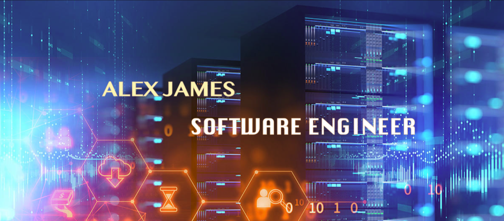

> I consider myself to be a generalist. I enjoy working in a full stack software and devops environment. I am not afraid of a challenge and am interested in all things programming. I am experienced with all steps of the development cycle for dynamic web apps. I enjoy consistently learning and challenging myself.

  

    
  

  
 

  
  

